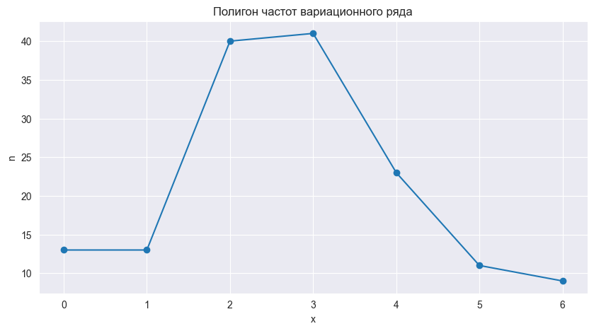
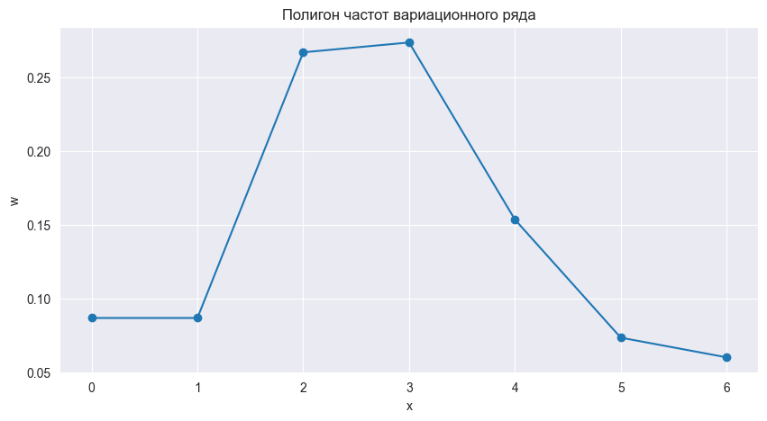
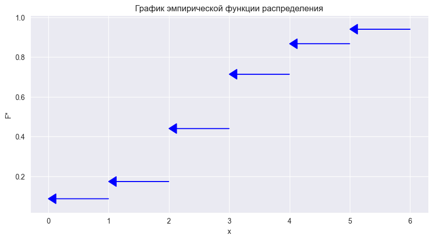

```python
import pandas as pd
import numpy as np
import seaborn as sns
import matplotlib.pyplot as plt
import plotly.express as px
from IPython.display import display, Math, Latex
from utils import Answer
```

# Лабораторная работа №1
## Задание 2
### {Фамилия Имя}, {Номер группы}, Вариант {Номер варианта}, ({Дата})

### Задание

По данным выборки ($n=150$) требуется:
1. Составить вариационный ряд и список вариантов.
2. Составить ряд распределения частот вариационного ряда и построить полигон частот.
3. Составить ряд распределения относительных частот вариационного ряда и построить полигон относительных частот.
4. Составить эмпирическую функцию распределения и построить график эмпирической функции распределения.
5. Найти основные числовые характеристики вариационного ряда:
    - Выборочное среднее - $\overline x_в$
    - Выборочную дисперсию - $S^2$
    - Стандартное отклонение (Среднеквадратическое отклонение) - $S$
    - Коэффициент вариации - $CV$
6. Пояснить смысл полученных результатов

### Данные


```python
LB_NUM = 1
LB_SURNAME = 'Фамилия'
LB_NAME = "Имя"
LB_VARIANT = 59
LB_EXERCISE_NUM = 2
print(f'Фамилия, Имя: {LB_SURNAME}, {LB_NAME}\nНомер лабораторной работы: {LB_NUM}\nВариант лабораторной работы: {LB_VARIANT}\nНомер задания лабораторной работы: {LB_EXERCISE_NUM}')
```

    Фамилия, Имя: Фамилия, Имя
    Номер лабораторной работы: 1
    Вариант лабораторной работы: 59
    Номер задания лабораторной работы: 2


```python
task = pd.read_json('input/Данные к заданию №2.json')
data = pd.Series(task['Данные'][LB_VARIANT - 1])
print(data.tolist())
```

    [3, 1, 4, 5, 0, 5, 4, 0, 2, 4, 3, 2, 3, 3, 2, 0, 6, 2, 3, 4, 2, 4, 2, 4, 3, 3, 3, 2, 0, 6, 1, 2, 3, 2, 2, 1, 3, 3, 3, 2, 0, 6, 0, 2, 4, 3, 2, 1, 6, 2, 2, 1, 2, 3, 2, 2, 4, 3, 1, 4, 5, 3, 4, 3, 1, 0, 2, 5, 3, 3, 1, 6, 2, 4, 5, 2, 4, 2, 4, 3, 4, 3, 1, 4, 5, 3, 0, 2, 4, 3, 2, 3, 4, 3, 1, 2, 3, 4, 0, 2, 5, 3, 3, 3, 3, 2, 0, 6, 2, 3, 1, 5, 2, 4, 2, 4, 3, 1, 2, 3, 2, 2, 2, 3, 4, 1, 6, 2, 3, 3, 2, 0, 6, 2, 5, 0, 2, 4, 3, 2, 6, 0, 2, 5, 3, 3, 3, 5, 4, 3]


### Всего элементов ряда


```python
data_len = data.count()
print(f'Всего элементов ряда: {data_len}')
```

    Всего элементов ряда: 150


## Пункт 1
**Составить вариационный ряд и список вариантов.**

### Вариационный ряд


```python
data_sort = data.sort_values()
print(data_sort.tolist())
```

    [0, 0, 0, 0, 0, 0, 0, 0, 0, 0, 0, 0, 0, 1, 1, 1, 1, 1, 1, 1, 1, 1, 1, 1, 1, 1, 2, 2, 2, 2, 2, 2, 2, 2, 2, 2, 2, 2, 2, 2, 2, 2, 2, 2, 2, 2, 2, 2, 2, 2, 2, 2, 2, 2, 2, 2, 2, 2, 2, 2, 2, 2, 2, 2, 2, 2, 3, 3, 3, 3, 3, 3, 3, 3, 3, 3, 3, 3, 3, 3, 3, 3, 3, 3, 3, 3, 3, 3, 3, 3, 3, 3, 3, 3, 3, 3, 3, 3, 3, 3, 3, 3, 3, 3, 3, 3, 3, 4, 4, 4, 4, 4, 4, 4, 4, 4, 4, 4, 4, 4, 4, 4, 4, 4, 4, 4, 4, 4, 4, 4, 5, 5, 5, 5, 5, 5, 5, 5, 5, 5, 5, 6, 6, 6, 6, 6, 6, 6, 6, 6]


### Варианты, $x_i$


```python
unique = sorted(data.unique())
print(unique)
```

    [0, 1, 2, 3, 4, 5, 6]


## Пункт 2
**Составить ряд распределения частот вариационного ряда и построить полигон частот.**

### Частота, $n_i$


```python
freq = pd.Series(data_sort).value_counts().sort_index()
freq = pd.DataFrame(freq, index=unique)
freq.columns=["Частота"]
freq = freq.T
freq
```


<div>
<table border="1" class="dataframe">
  <thead>
    <tr style="text-align: right;">
      <th></th>
      <th>0</th>
      <th>1</th>
      <th>2</th>
      <th>3</th>
      <th>4</th>
      <th>5</th>
      <th>6</th>
    </tr>
  </thead>
  <tbody>
    <tr>
      <th>Частота</th>
      <td>13</td>
      <td>13</td>
      <td>40</td>
      <td>41</td>
      <td>23</td>
      <td>11</td>
      <td>9</td>
    </tr>
  </tbody>
</table>
</div>


### Полигон частот вариационного ряда


```python
fig = px.line(x=unique, y=freq.iloc[0], markers=True, title='Полигон частот вариационного ряда')
fig.show()
```

![[newplot 4.png]]


```python
def plot_freq_polygon(x, y, title):
    sns.set_style("darkgrid")
    fig, ax = plt.subplots(figsize=(10, 5))
    ax.set_title(title)
    ax.plot(x, y, marker='o')
    ax.set_xlabel("x")
    ax.set_ylabel("n")
    plt.plot()


plot_freq_polygon(x=unique, y=freq.iloc[0], title='Полигон частот вариационного ряда')
```



## Пункт 3
**Составить ряд распределения относительных частот вариационного ряда и построить полигон относительных частот.**

### Относительная частота, $w_i$


```python
rel_freq = pd.Series(data_sort).value_counts().sort_index() / len(data_sort)
rel_freq = pd.DataFrame(rel_freq, index=unique)
rel_freq.columns=["Относительная частота"]
rel_freq = rel_freq.T
rel_freq
```


<div>
<table border="1" class="dataframe">
  <thead>
    <tr style="text-align: right;">
      <th></th>
      <th>0</th>
      <th>1</th>
      <th>2</th>
      <th>3</th>
      <th>4</th>
      <th>5</th>
      <th>6</th>
    </tr>
  </thead>
  <tbody>
    <tr>
      <th>Относительная частота</th>
      <td>0.086667</td>
      <td>0.086667</td>
      <td>0.266667</td>
      <td>0.273333</td>
      <td>0.153333</td>
      <td>0.073333</td>
      <td>0.06</td>
    </tr>
  </tbody>
</table>
</div>


### Полигон относительных частот вариационного ряда


```python
fig = px.line(x=unique, y=rel_freq.iloc[0], markers=True, title='Полигон относительных частот вариационного ряда')
fig.show()
```


![[newplot 5.png]]

```python
def plot_rel_freq_polygon(x, y, title):
    sns.set_style("darkgrid")
    fig, ax = plt.subplots(figsize=(10, 5))
    ax.set_title(title)
    ax.plot(x, y, marker='o')
    ax.set_xlabel("x")
    ax.set_ylabel("w")
    plt.plot()


plot_rel_freq_polygon(x=unique, y=rel_freq.iloc[0], title='Полигон частот вариационного ряда')
```


    

    


## Пункт 4
**Составить эмпирическую функцию распределения и построить график эмпирической функции распределения.**

### Эмпирическая функция распределения $F^*$


```python
emp_func = rel_freq.iloc[0].cumsum()
emp_func.name = "F*"
emp_func = pd.DataFrame(emp_func, index=unique).T
emp_func
```


![[newplot 6.png]]

<div>
<table border="1" class="dataframe">
  <thead>
    <tr style="text-align: right;">
      <th></th>
      <th>0</th>
      <th>1</th>
      <th>2</th>
      <th>3</th>
      <th>4</th>
      <th>5</th>
      <th>6</th>
    </tr>
  </thead>
  <tbody>
    <tr>
      <th>F*</th>
      <td>0.086667</td>
      <td>0.173333</td>
      <td>0.44</td>
      <td>0.713333</td>
      <td>0.866667</td>
      <td>0.94</td>
      <td>1.0</td>
    </tr>
  </tbody>
</table>
</div>


```python
def emp_func_latex(emp_func):
    latex_text = f'$$\nF^* (x) =\n\\begin{{cases}}\n'
    for i in range(len(emp_func.values.tolist()[0])):
        if i == 0:
            latex_text += f'0, && x \le {unique[0]:.2f} \\\\'
        elif i == len(emp_func.values.tolist()[0]) - 1:
            latex_text += f'{emp_func.values.tolist()[0][i - 1]:.2f}, && {unique[i - 1]:.2f} < x \le {unique[i]:.2f} \\\\'
            latex_text += f'1.0, && x > {unique[i]:.2f} \\\\'
        else:
            latex_text += f'{emp_func.values.tolist()[0][i - 1]:.2f}, && {unique[i - 1]:.2f} < x \le {unique[i]:.2f} \\\\'
        latex_text += "\n"
    latex_text += '\\end{cases}\n$$'
    return Math(latex_text) 


display(emp_func_latex(emp_func))
```


$\displaystyle 
F^* (x) =
\begin{cases}
0, && x \le 0.00 \\
0.09, && 0.00 < x \le 1.00 \\
0.17, && 1.00 < x \le 2.00 \\
0.44, && 2.00 < x \le 3.00 \\
0.71, && 3.00 < x \le 4.00 \\
0.87, && 4.00 < x \le 5.00 \\
0.94, && 5.00 < x \le 6.00 \\1.0, && x > 6.00 \\
\end{cases}
$


### График эмпирической функции распределения


```python
fig = px.ecdf(x=unique, y=emp_func.values.tolist()[0], markers=True, title='График эмпирической функции распределения')
fig.show()
```


```python
def plot_cdf_func(x, y, title):
    fig, ax = plt.subplots(figsize=(10, 5))
    min_y, max_y = min(y), max(y)
    arrow_length = ((max(x) - min(x)) / len(x)) * .15
    for idx in range(len(y) - 1):
        dx = x[idx] - x[idx + 1]
        ax.arrow(x=x[idx + 1], y=y[idx], dx=dx, dy=0, 
                 color="blue", head_width=.05, head_length=arrow_length,
                 length_includes_head=True)
    ax.set_title(title)
    ax.set_ylabel("F*")
    ax.set_xlabel("x")
    plt.plot()


plot_cdf_func(unique, emp_func.iloc[0].tolist(), 'График эмпирической функции распределения')
```


    

    


## Пункт 5
**Найти основные числовые характеристики вариационного ряда**

### Выборочное среднее, $\overline x$

$$\overline x = \frac1n \sum^n_{i=1} x_i$$


```python
mean = np.mean(data)
print(f'Выборочное среднее: {mean:.2f}')
```

    Выборочное среднее: 2.78


### Выборочная дисперсия, $s^2_x$

$$s^2_x = \frac{1}{n-1}\sum^n_{i=1} (x_i - \overline x)^2$$


```python
var = np.var(data, ddof=1)
print(f'Выборочная дисперсия: {var:.2f}')
```

    Выборочная дисперсия: 2.35


### Стандартное отклонение (Среднеквадратическое отклонение), $s_x$

$$s_x = \sqrt{s^2}$$


```python
std = np.std(data, ddof=1)
print(f'Среднеквадратическое отклонение: {std:.2f}')
```

    Среднеквадратическое отклонение: 1.53


### Коэффицент вариации, $CV$

$$CV = \frac{s}{\overline x} \cdot 100$$


```python
cv = (std / mean) * 100
cv
```


    55.11054713812624


## Пункт 6
**Пояснить смысл полученных результатов.**

$$\overline x = 2.77$$
$$s^2_x = 2.28$$
$$s = 1.51$$
$$CV = 54.49$$
