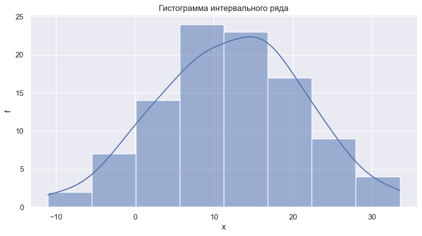

```python
import pandas as pd
import numpy as np
import scipy.stats as st
from IPython.display import display, Markdown
import matplotlib.pyplot as plt
import seaborn as sns
```

# Лабораторная работа №3
## Задание 5
### {Фамилия Имя}, {Номер группы}, Вариант {Номер варианта}, ({Дата})

### Данные

По данным выборки проверить с помощью критерия Пирсона при уровне значимости α гипотезу:
- о показательном;
- равномерном;
- нормальном законе распределения генеральной совокупности.

В ответе привести:
1) выбранную гипотезу о виде закона распределения;
2) вычисленное значение критерия;
3) критическое значение;
4) вывод о принятии или не принятии гипотезы.


```python
src_data = pd.Series([15.6, 29.1, -5.3, 8.8, 8.7, 2.5, 10.3, 14.4, 21.5, 9.9, 33.5, 15.9, 8.0, 21.4, 9.9, 1.7, 11.2, 9.0, 4.5, 26.2, 3.2, 11.0, 18.3, 5.7, 21.4, 14.4, 17.5, -1.4, 0.3, 17.5, 8.8, 16.0, 0.7, 4.2, 12.2, 14.6, 16.8, 15.2, 17.0, 17.2, -1.7, 24.0, 23.6, 33.2, 21.4, 10.4, 1.5, 8.1, 12.2, 8.2, 17.6, 9.5, 22.9, 9.0, 30.0, 18.2, -10.0, -4.6, 21.4, 20.1, 18.4, 24.3, 7.5, 12.5, 7.7, 0.2, -11.0, 24.2, 24.8, 6.0, 6.6, 15.9, 15.5, 18.6, 4.3, 21.4, 8.0, 13.9, 3.9, 25.2, 16.8, 14.2, 11.8, 16.4, 14.2, 2.9, -2.3, 14.8, 19.7, -1.3, 6.0, 14.7, 9.5, 2.8, 25.0, -0.4, 9.9, 16.3, 4.8, 16.0])
n = len(src_data)
alpha = 0.025

src_data
```


    0     15.6
    1     29.1
    2     -5.3
    3      8.8
    4      8.7
          ... 
    95    -0.4
    96     9.9
    97    16.3
    98     4.8
    99    16.0
    Length: 100, dtype: float64


```python
Markdown(f'$n = {n}$, $\\alpha = {alpha}$')
```


$n = 100$, $\alpha = 0.025$


## Шаг 1: Построение интервального ряда


```python
m = int(np.ceil(np.log2(n) + 1))
m
```


    8


```python
bins = src_data.value_counts(bins=m).sort_index()
data = pd.DataFrame()
data['x_i'] = list(map(lambda x: x.left, bins.index))
data['x_(i+1)'] = list(map(lambda x: x.right, bins.index))
data['f'] = bins.values
data
```


<div>

<table border="1" class="dataframe">
  <thead>
    <tr style="text-align: right;">
      <th></th>
      <th>x_i</th>
      <th>x_(i+1)</th>
      <th>f</th>
    </tr>
  </thead>
  <tbody>
    <tr>
      <th>0</th>
      <td>-11.045</td>
      <td>-5.438</td>
      <td>2</td>
    </tr>
    <tr>
      <th>1</th>
      <td>-5.438</td>
      <td>0.125</td>
      <td>7</td>
    </tr>
    <tr>
      <th>2</th>
      <td>0.125</td>
      <td>5.688</td>
      <td>14</td>
    </tr>
    <tr>
      <th>3</th>
      <td>5.688</td>
      <td>11.250</td>
      <td>24</td>
    </tr>
    <tr>
      <th>4</th>
      <td>11.250</td>
      <td>16.812</td>
      <td>23</td>
    </tr>
    <tr>
      <th>5</th>
      <td>16.812</td>
      <td>22.375</td>
      <td>17</td>
    </tr>
    <tr>
      <th>6</th>
      <td>22.375</td>
      <td>27.938</td>
      <td>9</td>
    </tr>
    <tr>
      <th>7</th>
      <td>27.938</td>
      <td>33.500</td>
      <td>4</td>
    </tr>
  </tbody>
</table>
</div>


```python
def hist(data):
    sns.set_theme()
    fig, ax = plt.subplots(figsize=(10, 5))
    ax = sns.histplot(data, bins=m, kde=True, ax=ax)
    ax.set_xlabel("x")
    ax.set_ylabel("f")
    ax.set_title("Гистограмма интервального ряда")
    plt.plot()

hist(src_data)
```
   

    


## Шаг 2: Проверка гипотезы о показательном распределение


```python
dist = "показательным"
Markdown(f"""
- $H_0$: закон распределения генеральной совокупности является {dist}.
- $H_1$: закон распределения генеральной совокупности не является {dist}.
""")
```


- $H_0$: закон распределения генеральной совокупности является показательным.
- $H_1$: закон распределения генеральной совокупности не является показательным.


### Вычисление среднего значения

$$\overline{x} = \frac{1}{n} \sum_{i=1}^{n} x_i$$


```python
def mean_interval_row(xi, xj, f):
    x_mean = (xi + xj) / 2
    return (x_mean * f).sum() / f.sum()

mean = mean_interval_row(data["x_i"], data["x_(i+1)"], data["f"])
mean
```


    12.139555


Для проверки гипотезы о показательном распределения воспользуемся критерием согласия хи-квадрат. Нужно вычислить теоретические (ожидаемые) частоты попадания значений в каждый интервал, если бы распределение было равномерным. Для этого воспользуемся формулой:
$$P_i=P(x_i < X < x_{i+1})=e^{-\lambda x_i} - e^{-\lambda x_{i+1}}$$
$$f' = fP_i$$
$$\lambda = 1/\bar{x}$$


```python
lmbda = 1 / mean
lmbda
```


    0.08237534242400155


```python
p = st.expon.cdf(data["x_(i+1)"], scale=1/lmbda) - st.expon.cdf(data["x_i"], scale=1/lmbda)
p, p.sum()
```


    (array([0.        , 0.01024409, 0.36384733, 0.23005964, 0.14549867,
            0.09203206, 0.05819986, 0.03679961]),
     0.9366812617799309)


```python
data["f'"] = p * data["f"].sum()
data["f'"]
```


    0     0.000000
    1     1.024409
    2    36.384733
    3    23.005964
    4    14.549867
    5     9.203206
    6     5.819986
    7     3.679961
    Name: f', dtype: float64


Вычислим значение статистики критерия $\chi^2$:


$$\chi^2 = \sum_{i=1}^{k} \frac{(f_i - f_i^*)^2}{f_i^*} = \frac{(\text{наблюдаемая частота} - \text{ожидаемая частота})^2}{\text{ожидаемая частота}}$$


```python
chi2_value_expon = ((data["f"] - data["f'"])**2 / data["f'"]).sum()
chi2_value_expon
```


    inf


#### Степени свободы:


```python
df = (data["f"] >= 5).sum() - 2
df
```


    4


#### Критическое значение


```python
chi2_critical_expon = st.chi2.ppf(1-alpha, df=df)
chi2_critical_expon
```


    11.143286781877796


```python
display(Markdown(f"Так как вычисленное значение статистики критерия Пирсона ($\chi^2 = {chi2_value_expon}$) превышает критическое значение ($\chi^2 = {chi2_critical_expon}$), то мы отвергаем нулевую гипотезу $H_0$ и приниамаем альтернативную гипотезу $H_1$. Это означает, что закон распределения генеральной совокупности не является {dist}."))
```


Так как вычисленное значение статистики критерия Пирсона ($\chi^2 = inf$) превышает критическое значение ($\chi^2 = 11.143286781877796$), то мы отвергаем нулевую гипотезу $H_0$ и приниамаем альтернативную гипотезу $H_1$. Это означает, что закон распределения генеральной совокупности не является показательным.


## Шаг 3: Проверка гипотезы о равномерном распределение


```python
dist = "равномерным"
Markdown(f"""
- $H_0$: закон распределения генеральной совокупности является {dist}.
- $H_1$: закон распределения генеральной совокупности не является {dist}.
""")
```


- $H_0$: закон распределения генеральной совокупности является равномерным.
- $H_1$: закон распределения генеральной совокупности не является равномерным.


### Вычисление дисперсии

$$s^2 = \frac{1}{n-1} \sum_{i=1}^{n} (x_i - \overline{x})^2$$


```python
def var_interval_row(xi, xj, f):
    x_mean = (xi + xj) / 2
    mean_square = ((x_mean ** 2) * f).sum() / f.sum()
    mean = mean_interval_row(xi, xj, f)
    return mean_square - mean ** 2

variance = var_interval_row(data["x_i"], data["x_(i+1)"], data["f"])
variance
```


    78.126559814475


### Вычисление стандартного отклонения

$$s = \sqrt{s^2}$$


```python
std = np.sqrt(variance)
std
```


    8.838923000822838


Для проверки гипотезы о равномерном распределения воспользуемся критерием согласия хи-квадрат. Нужно вычислить теоретические (ожидаемые) частоты попадания значений в каждый интервал, если бы распределение было равнромерным. Для этого воспользуемся формулой:
$$P_i=P(x_i < X < x_{i+1})=\frac{1}{b^{*} - a^{*}}$$
$$\text{при} \space a^{*} \leq x_j \leq b^{*} $$
$$f' = fP_i$$
$$a^{*} = \bar{x} - \sqrt{3} \cdot S$$
$$b^{*} = \bar{x} + \sqrt{3} \cdot S$$


```python
a = mean - np.sqrt(3) * std
b = mean + np.sqrt(3) * std
a, b
```


    (-3.16990872161432, 27.44901872161432)


```python
p = st.uniform.cdf(data["x_(i+1)"], loc=a, scale=b-a) - st.uniform.cdf(data["x_i"], loc=a, scale=b-a)

assert np.isclose(p.sum(), 1, rtol=.01), "Сумма теоретических оснований должна быть равна 1."
p
```


    array([0.        , 0.10761019, 0.18168501, 0.18165235, 0.18165235,
           0.18168501, 0.1657151 , 0.        ])


```python
data["f'"] = p * data["f"].sum()
data["f'"]
```


    0     0.000000
    1    10.761019
    2    18.168501
    3    18.165235
    4    18.165235
    5    18.168501
    6    16.571510
    7     0.000000
    Name: f', dtype: float64


Вычислим значение статистики критерия $\chi^2$:


$$\chi^2 = \sum_{i=1}^{k} \frac{(f_i - f_i^*)^2}{f_i^*} = \frac{(\text{наблюдаемая частота} - \text{ожидаемая частота})^2}{\text{ожидаемая частота}}$$


```python
((data["f"] - data["f'"])**2 / data["f'"])
```


    0         inf
    1    1.314491
    2    0.956402
    3    1.874156
    4    1.286796
    5    0.075152
    6    3.459417
    7         inf
    dtype: float64


```python
chi2_value_uniform = ((data["f"] - data["f'"])**2 / data["f'"]).sum()
chi2_value_uniform
```


    inf


#### Степени свободы:


```python
df = (data["f"] >= 5).sum() - 3
df
```


    3


#### Критическое значение


```python
chi2_critical_uniform = st.chi2.ppf(1-alpha, df=df)
chi2_critical_uniform
```


    9.348403604496148


```python
display(Markdown(f"Так как вычисленное значение статистики критерия Пирсона ($\chi^2 = {chi2_value_uniform}$) превышает критическое значение ($\chi^2 = {chi2_critical_uniform}$), то мы отвергаем нулевую гипотезу $H_0$ и приниамаем альтернативную гипотезу $H_1$. Это означает, что закон распределения генеральной совокупности не является {dist}."))
```


Так как вычисленное значение статистики критерия Пирсона ($\chi^2 = inf$) превышает критическое значение ($\chi^2 = 9.348403604496148$), то мы отвергаем нулевую гипотезу $H_0$ и приниамаем альтернативную гипотезу $H_1$. Это означает, что закон распределения генеральной совокупности не является равномерным.


## Шаг 4: Проверка гипотезы о нормальном распределение


```python
dist = "нормальным"
Markdown(f"""
- $H_0$: закон распределения генеральной совокупности является {dist}.
- $H_1$: закон распределения генеральной совокупности не является {dist}.
""")
```


- $H_0$: закон распределения генеральной совокупности является нормальным.
- $H_1$: закон распределения генеральной совокупности не является нормальным.


Для проверки гипотезы о нормальности распределения воспользуемся критерием согласия хи-квадрат. Нужно вычислить теоретические (ожидаемые) частоты попадания значений в каждый интервал, если бы распределение было нормальным. Для этого воспользуемся формулой:
$$P_i=P(x_i < X < x_{i+1})=Ф(\frac{x_{i+1} - \bar{x}}{S}) - Ф(\frac{x_{i} - \bar{x}}{S})$$
$$f' = fP_i$$


```python
p = st.norm.cdf((data["x_(i+1)"] - mean) / std) - st.norm.cdf((data["x_i"] - mean) / std)

data["f'"] = p * data["f"].sum()
data["f'"]
```


    0     1.901186
    1     6.365950
    2    14.569556
    3    22.719307
    4    24.154813
    5    17.510135
    6     8.649398
    7     2.910631
    Name: f', dtype: float64


Вычислим значение статистики критерия $\chi^2$:


$$\chi^2 = \sum_{i=1}^{k} \frac{(f_i - f_i^*)^2}{f_i^*} = \frac{(\text{наблюдаемая частота} - \text{ожидаемая частота})^2}{\text{ожидаемая частота}}$$


```python
chi2_value_norm = ((data["f"] - data["f'"])**2 / data["f'"]).sum()
chi2_value_norm
```


    0.6547506282482705


#### Степени свободы:


```python
df = (data["f"] >= 5).sum() - 3
df
```


    3


#### Критическое значение


```python
chi2_critical_norm = st.chi2.ppf(1-alpha, df=df)
chi2_critical_norm
```


    9.348403604496148


```python
display(Markdown(f"Так как вычисленное значение статистики критерия Пирсона ($\chi^2 = {chi2_value_norm}$) превышает критическое значение ($\chi^2 = {chi2_critical_norm}$), то мы принимаем нулевую гипотезу $H_0$ и отвергаем альтернативную гипотезу $H_1$. Это означает, что закон распределения генеральной совокупности является {dist}."))
```


Так как вычисленное значение статистики критерия Пирсона ($\chi^2 = 0.6547506282482705$) превышает критическое значение ($\chi^2 = 9.348403604496148$), то мы принимаем нулевую гипотезу $H_0$ и отвергаем альтернативную гипотезу $H_1$. Это означает, что закон распределения генеральной совокупности является нормальным.


## Шаг 5: Вывод


```python
display(Markdown("## Вывод"))
display(Markdown(f"Таблица распределения хи-квадрат ($\chi^2$) со степенями свободы {df} и уровнем значимости {alpha} даёт критическое значение $\chi^2 = {chi2_critical_norm}$."))
display(Markdown(f"Так как вычисленное значение статистики критерия Пирсона ($\chi^2 = {chi2_value_norm}$) превышает критическое значение ($\chi^2 = {chi2_critical_norm}$), то мы принимаем нулевую гипотезу $H_0$ и отвергаем альтернативную гипотезу $H_1$. Это означает, что закон распределения генеральной совокупности является {dist}."))
```


## Вывод


Таблица распределения хи-квадрат ($\chi^2$) со степенями свободы 3 и уровнем значимости 0.025 даёт критическое значение $\chi^2 = 9.348403604496148$.


Так как вычисленное значение статистики критерия Пирсона ($\chi^2 = 0.6547506282482705$) превышает критическое значение ($\chi^2 = 9.348403604496148$), то мы принимаем нулевую гипотезу $H_0$ и отвергаем альтернативную гипотезу $H_1$. Это означает, что закон распределения генеральной совокупности является нормальным.

